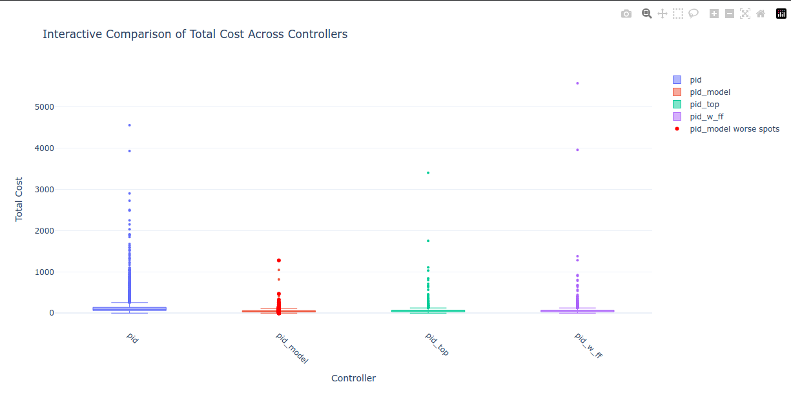
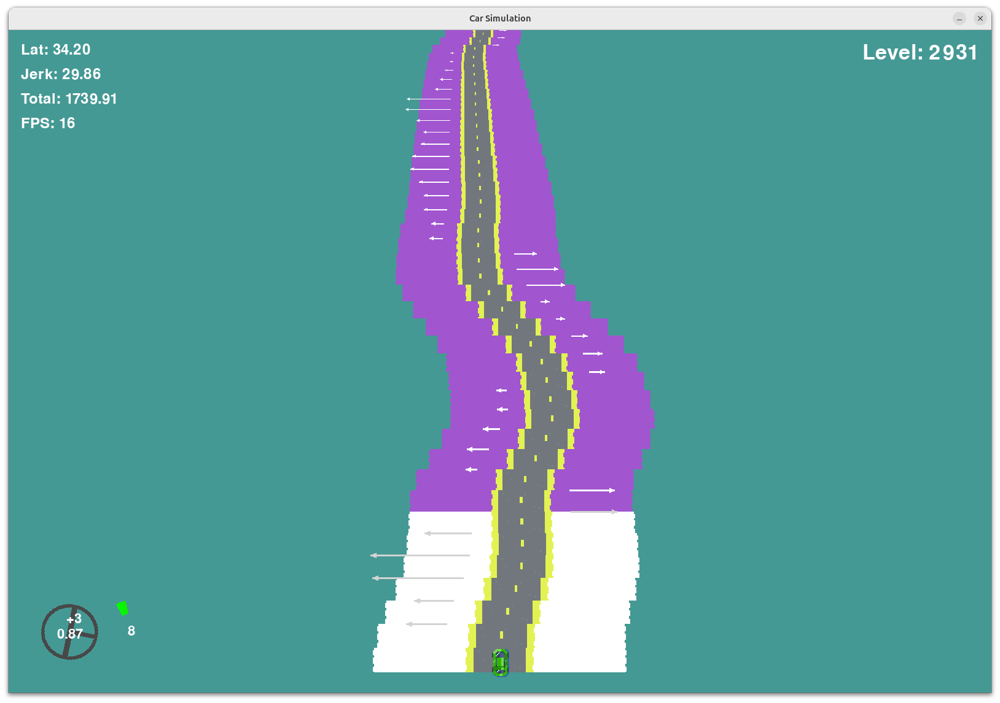
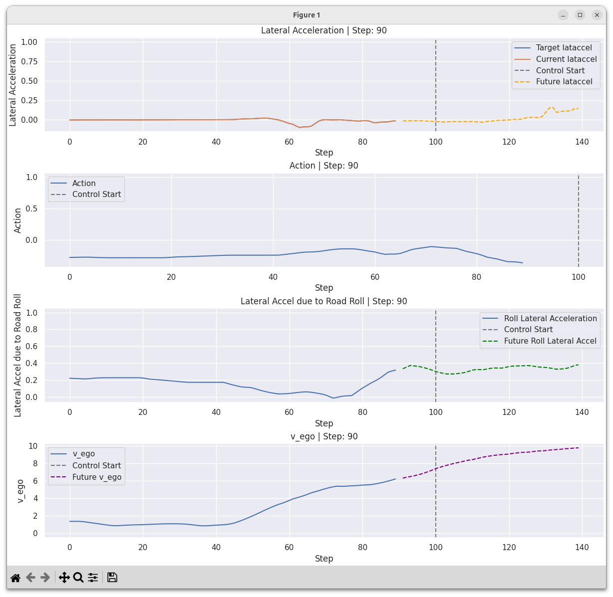

<div align="center">
<h1>comma Controls Challenge v2</h1>

<h3> Prize money: best score between August 5th and September 1st 2024 wins $500!</h3>


<h3>
  <a href="https://comma.ai/leaderboard">Leaderboard</a>
  <span> · </span>
  <a href="https://comma.ai/jobs">comma.ai/jobs</a>
  <span> · </span>
  <a href="https://discord.comma.ai">Discord</a>
  <span> · </span>
  <a href="https://x.com/comma_ai">X</a>
</h3>

</div>

Machine learning models can drive cars, paint beautiful pictures and write passable rap. But they famously suck at doing low level controls. Your goal is to write a good controller. This repo contains a model that simulates the lateral movement of a car, given steering commands. The goal is to drive this "car" well for a given desired trajectory.

## Changes to this Fork
### New `pid_model` controller
This neural network based controller outperforms all other known controllers. This graph illustrates the cost of all 5000 simulations across a variety of controllers, to compare their performance.


### 2D Racing Game
Instead of relying only on PID data for training this model, I built a 2D racing game to collect human driving data. This is compatible with the keyboard and a Logitech steering wheel. This allows me to collect more realistic human driving data, for the most complex and dynamic trajectories. 



### TinyPhysics Improvements
- Improved graphing to include future states as dotted lines. This was useful to view the stability of future states,
before deciding to build a 2D racing sim based mostly on these future values. 
- Improved the simulator to pass the initial steer values to each controller,
to help controllers smoothly take over control of the vehicle.
- Improved random number generation to be multi-thread friendly, so we can run multiple simulations at the same time.


### Results for `pid_model`
Proof that a neural network can surpass all other PID controller designs. Read the [full results](report.html) here.


## Getting Started
We'll be using a synthetic dataset based on the [comma-steering-control](https://github.com/commaai/comma-steering-control) dataset for this challenge. These are actual car and road states from [openpilot](https://github.com/commaai/openpilot) users.

```
# install required packages
# recommended python==3.11
pip install -r requirements.txt

# test this works
python tinyphysics.py --model_path ./models/tinyphysics.onnx --data_path ./data/00000.csv --debug --controller pid 
```

There are some other scripts to help you get aggregate metrics: 
```
# batch Metrics of a controller on lots of routes
python tinyphysics.py --model_path ./models/tinyphysics.onnx --data_path ./data --num_segs 100 --controller pid

# generate a report comparing two controllers
python eval.py --model_path ./models/tinyphysics.onnx --data_path ./data --num_segs 100 --test_controller pid --baseline_controller zero

```
You can also use the notebook at [`experiment.ipynb`](https://github.com/commaai/controls_challenge/blob/master/experiment.ipynb) for exploration.

## TinyPhysics
This is a "simulated car" that has been trained to mimic a very simple physics model (bicycle model) based simulator, given realistic driving noise. It is an autoregressive model similar to [ML Controls Sim](https://blog.comma.ai/096release/#ml-controls-sim) in architecture. Its inputs are the car velocity (`v_ego`), forward acceleration (`a_ego`), lateral acceleration due to road roll (`road_lataccel`), current car lateral acceleration (`current_lataccel`), and a steer input (`steer_action`), then it predicts the resultant lateral acceleration of the car.


## Controllers
Your controller should implement a new [controller](https://github.com/commaai/controls_challenge/tree/master/controllers). This controller can be passed as an arg to run in-loop in the simulator to autoregressively predict the car's response.


## Evaluation
Each rollout will result in 2 costs:
- `lataccel_cost`: $\dfrac{\Sigma(actual\\_lat\\_accel - target\\_lat\\_accel)^2}{steps} * 100$

- `jerk_cost`: $\dfrac{\Sigma((actual\\_lat\\_accel\_t - actual\\_lat\\_accel\_{t-1}) / \Delta t)^2}{steps - 1} * 100$

It is important to minimize both costs. `total_cost`: $(lataccel\\_cost * 50) + jerk\\_cost$

## Submission
Run the following command, then submit `report.html` and your code to [this form](https://forms.gle/US88Hg7UR6bBuW3BA).

```
python eval.py --model_path ./models/tinyphysics.onnx --data_path ./data --num_segs 5000 --test_controller <insert your controller name> --baseline_controller pid
```

## Changelog
- With [this commit](https://github.com/commaai/controls_challenge/commit/fdafbc64868b70d6ec9c305ab5b52ec501ea4e4f) we made the simulator more robust to outlier actions and changed the cost landscape to incentivize more aggressive and interesting solutions.
- With [this commit](https://github.com/commaai/controls_challenge/commit/4282a06183c10d2f593fc891b6bc7a0859264e88) we fixed a bug that caused the simulator model to be initialized wrong.

## Work at comma

Like this sort of stuff? You might want to work at comma!
[comma.ai/jobs](https://comma.ai/jobs)
